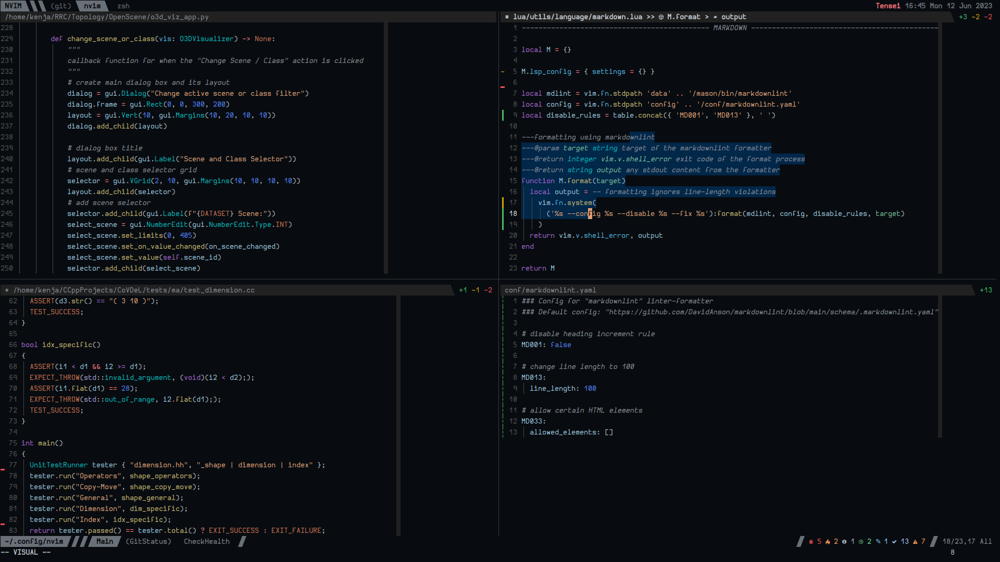

# :crescent_moon: Midnight

A modern black [neovim](https://github.com/neovim/neovim) theme written in Lua, with a strong focus
on maintaining a comfortable level of color contrast for a pleasant visual experience while coding.

## Showcase




More screenshots can be found in the [showcase](showcase) folder, if you want to know what you'll be
getting from this theme.

## Vision

As a lover of dark themes and all things black, I searched far and wide for black background
colorschemes when I first started using **neovim**. Although I have used many well-crafted themes so
far, it would always come down to choosing between one of these two: *healthy color contrast* and
*focused semantic clarity*. It is quite difficult to nail the balance between both, especially when
working with ***black*** backgrounds. Focusing too much on the former would result in a tame and
uniform looking theme, whereas too much emphasis on the latter would cause the screen content to
have sharp changes in color straining the eyes. I created this colorscheme to find the perfect
balance between both, to provide focus and clarity while ensuring a healthy contrast level.

**midnight.nvim** leans towards mostly using shades of gray, followed by blue-green shades for a
cooler UI color experience, while using warmer colors only for syntax and status. Most colors have
sufficiently low saturation so they do not stand out against the jet black background to avoid eye
strain when working for a longer duration (particularly beneficial in low-light conditions).

***NOTE: This plugin is a WIP. There are still a few color choices that I am not satisfied with and
will be changed in the future. Other than these select few, most colors are stable and the theme's
appearance will not change as a whole.***

## Features

- Support for treesitter and LSP syntax groups for multiple filetypes
- Appropriate color contrast between content and UI to reduce eye strain while maintaining focus
- Darker shades of gray for non-critical UI elements such as separators to reduce distraction
- Consistent usage of the palette across plugins and neovim builtins to provide a unified IDE-like
appearance
- Warmer colors for language syntax groups to attract attention intuitively in dense code
files

#### Integrations

The following plugins have fully customized highlight groups -

- [diffview.nvim](https://github.com/sindrets/diffview.nvim)
- [gitsigns.nvim](https://github.com/lewis6991/gitsigns.nvim)
- [lazy.nvim](https://github.com/folke/lazy.nvim)
- [mason.nvim](https://github.com/williamboman/mason.nvim)
- [neorg](https://github.com/nvim-neorg/neorg)
- [nvim-cmp](https://github.com/hrsh7th/nvim-cmp)
- [nvim-dap-ui](https://github.com/rcarriga/nvim-dap-ui)
- [nvim-lspconfig](https://github.com/neovim/nvim-lspconfig)
- [nvim-notify](https://github.com/rcarriga/nvim-notify)
- [nvim-tree.lua](https://github.com/nvim-tree/nvim-tree.lua)
- [telescope.nvim](https://github.com/nvim-telescope/telescope.nvim)
- [todo-comments.nvim](https://github.com/folke/todo-comments.nvim)
- [vim-illuminate](https://github.com/RRethy/vim-illuminate)

## Installation

Install the colorscheme using the package manager that you love!

[lazy.nvim](https://github.com/folke/lazy.nvim)

```lua
-- LazySpec (plugin specification)
-- return {
{ 'dasupradyumna/midnight.nvim', lazy = false, priority = 1000 }
-- `lazy` and `priority` are only needed if this is your primary colorscheme to load it first
-- }
```

[packer.nvim](https://github.com/wbthomason/packer.nvim)

```lua
-- inside setup function
-- packer.startup(function(use)
use { 'dasupradyumna/midnight.nvim' }
-- end)
```

### Requirements

***midnight.nvim*** is a *GUI-only* colorscheme. It requires GUI client or a modern terminal version
of **neovim** installed in a
[true-color supported](https://github.com/termstandard/colors#truecolor-support-in-output-devices)
terminal emulator.

**Neovim** version should be newer than 0.8.0.

## Usage

Add the following code snippet to load the colorscheme.

```lua
-- Lua
vim.cmd.colorscheme 'midnight'
```

```vim
" VimScript
colorscheme midnight
```

### Configuration

Configuration can be skipped if the user does not wish to change any of the default higlight groups.
The plugin runs setup automatically when it is loaded using the `colorscheme` command.

For now, users can directly add overriding higlight groups as arguments to the `setup()` method.
Better options will be added in the future to make the colorscheme customization simpler.

```lua
require('midnight').setup {
    HighlightGroup = {
        fg = ForegroundColor, -- :h guifg
        bg = BackgroundColor, -- :h guibg
        sp = SpecialColor, -- :h guisp
        style = RenderStyle, -- :h attr-list
        -- OR
        link = TargetHiglightGroup -- :h :hi-link (link to "TargetHiglightGroup")
        -- OR
        clear = true -- :h :hi-clear (clear "HighlightGroup"; `false` ignores this option)
    },
    ...
}
```

The evaluation priority of options within a highlight specification (*like above*) is:

1. When `clear = true` is specified, all other attributes are ignored
2. When a `link` group name is specified, all attributes except `clear` are ignored
3. Highlight specification using `fg`, `bg`, `sp` and `style` is evaluated only if above attributes
are not specified

### Color Palette

Although quite limited in variety, **midnight.nvim** color palette can be used from
[palette.lua](lua/midnight/palette.lua), if the user so wishes.

```lua
local colors = require('midnight.colors')
local p = colors.palette -- raw color palette
local c = colors.components -- component color palette
```

## Contributing

I encourage fellow contributors to submit PRs if they wish to fix a bug or add a plugin.  
Since I cannot feasibly test out every single possibility, I would love it if contributors can help
in improving the documentation especially for other package managers.  
I would also like help with LSP and treesitter groups for languages that have not been covered.

*Since this is my first plugin, all suggestions and advice from the more experienced are welcome.*

## Thanks

This colorscheme's design was inspired by **nyoom-engineering**'s
[oxocarbon.nvim](https://github.com/nyoom-engineering/oxocarbon.nvim) and highlighting logic
was inspired by **folke**'s [tokyonight.nvim](https://github.com/folke/tokyonight.nvim).

## License

**midnight.nvim** is licensed under the *Apache License 2.0*.

### More plugins by Author

[launch.nvim](https://github.com/dasupradyumna/launch.nvim) :rocket:
A task launcher plugin allowing dynamic task configuration for every working directory *(with
optional support for debugging via **nvim-dap**)*
